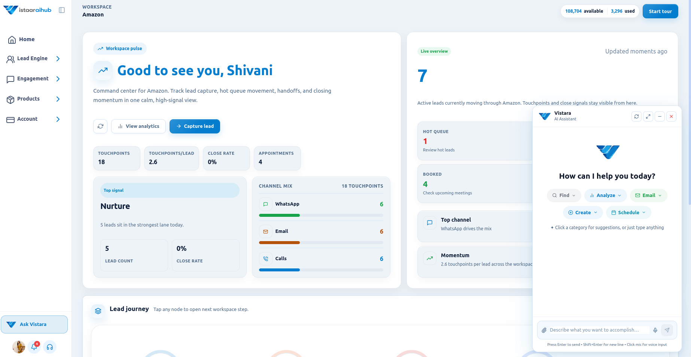
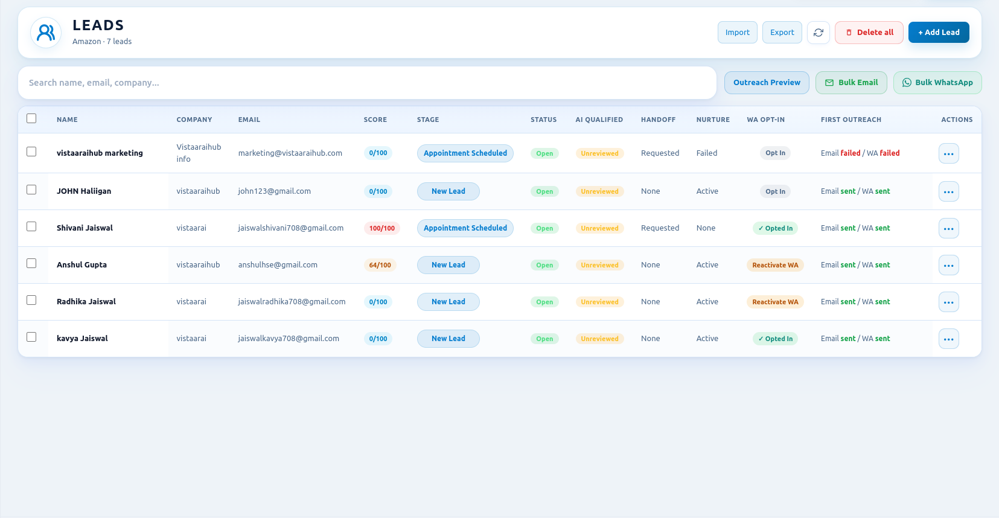
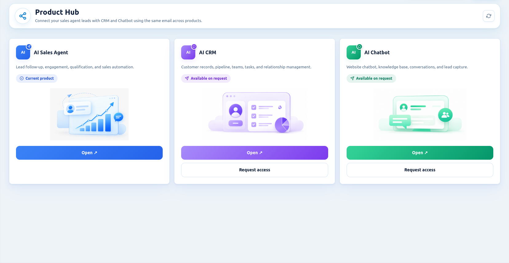
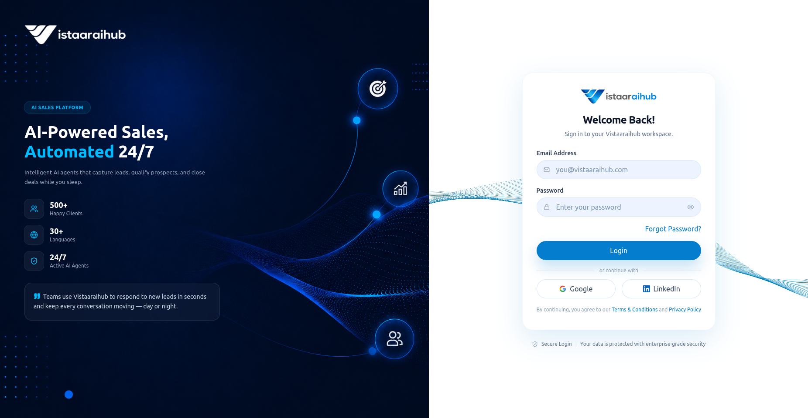

<div align="center">


# Vistaaraihub

### AI agents for sales, CRM and customer conversations, built for growing teams

Automate the repetitive work. Keep humans in control. Scale revenue.

[](https://vistaaraihub.com)
[](https://vistaaraihub.com/demo)
[](https://salesagentai.vistaaraihub.com/)

[](https://linkedin.com/company/Vistaaraihub)
[](https://x.com/Vistaaraihub)
[](https://www.youtube.com/@Vistaaraihub)
[](https://instagram.com/Vistaaraihub)

<br /><br />

<a href="https://vistaaraihub.com">
  
</a>

</div>

---

## 📌 About

**Vistaaraihub** is an AI agent platform for modern sales teams, operated by **VISTAARAI INFOTECH PRIVATE LIMITED**, India.

We build practical, purpose-built AI agents that handle lead qualification, follow-ups, CRM updates and customer conversations, so small and growing teams can respond like much larger ones without losing control of their pipeline.

**Our principles**

- 🧑‍💼 **Human in the loop:** agents support your team; they don't replace it
- 📒 **Clear records:** every action is logged and traceable
- ✅ **Consent first:** communication respects customer consent
- 🔒 **Responsible AI:** transparent, practical and privacy-conscious (GDPR-aligned)

---

## 🚀 Featured Product: SalesAiAgent

> **Your AI sales co-pilot.** Qualifies every inbound lead, scores buyer intent and sends personalized follow-ups automatically, so your reps only talk to prospects who are ready.

👉 **[Get started with SalesAiAgent](https://salesagentai.vistaaraihub.com/)** · **[Learn more](https://vistaaraihub.com/agents/sales-ai-agent)**

<p align="center">
  <a href="https://vistaaraihub.com/agents/sales-ai-agent">
    
  </a>
</p>

| ⏱️ **< 2 min** | 🌙 **24/7** | 🚀 **1 day** | 🔄 **Real-time** |
|:---:|:---:|:---:|:---:|
| Average lead response time | Always active | Setup to first action | CRM sync after every interaction |

### 📸 Product screenshots

<!--
  HOW TO ADD YOUR SCREENSHOTS:
  1. In this repo, click "Add file" → "Upload files".
  2. Upload your images into an "assets" folder next to this README
     (for an org profile README that is: profile/assets/).
  3. Keep these exact file names, or change the names below to match yours.
-->

<table>
  <tr>
    <td align="center" width="50%">
      <br />
      <sub><b>Dashboard:</b> leads, scores and pipeline at a glance</sub>
    </td>
    <td align="center" width="50%">
      <br />
      <sub><b>Lead queue:</b> every lead scored by buyer intent</sub>
    </td>
  </tr>
  <tr>
    <td align="center" width="50%">
      <br />
      <sub><b>Pipeline:</b> deal stages updated automatically</sub>
    </td>
    <td align="center" width="50%">
      <br />
      <sub><b>Get started:</b> sign in and go live in a day</sub>
    </td>
  </tr>
</table>

### The problem

Leads arrive from websites, ads, portals and referrals, but follow-up is slow and inconsistent. A lead fills a form at night and hears back the next morning, and by then they've moved on. Meanwhile reps spend hours on qualification calls that go nowhere.

### The solution

SalesAiAgent responds the moment a lead arrives, qualifies it, scores it and keeps it warm until a human is needed.

### ✨ Key features

| Feature | What it does |
|---|---|
| ⚡ **Instant lead qualification** | Every inbound inquiry is qualified automatically, with no queue |
| 🎯 **Lead scoring** | Each lead gets an intent score so reps know who to call first |
| 📨 **Personalized follow-ups** | Automated, context-aware sequences keep leads warm |
| 📈 **Buyer intent signals** | See in real time which prospects are ready to talk |
| 🧾 **Zero manual data entry** | Lead details and activity are captured automatically |
| 🔌 **Works with your stack** | Connects to your CRM, calendar and communication tools |
| 🤝 **Smart handoff** | Warm leads are passed to your team at the right moment |

### 🛠️ How it works

```
 1. Choose your agent      →   Start with SalesAiAgent (or combine agents)
 2. Connect your stack     →   Plug in CRM, calendar and lead sources in minutes
 3. Deploy & scale         →   Live within a day: qualifying, scoring, following up
```

### 🔌 Integrations

<p align="center">
  
  
  
  
  
  
  
  
  
  
  
  
</p>

### 💡 Use cases

- Respond to form fills and ad leads within minutes, 24/7
- Re-engage dormant leads sitting untouched in your CRM
- Separate serious buyers from window-shoppers before a rep steps in
- Nurture "contact me in 3 months" leads with timed follow-ups

---

## 🤖 The Vistaaraihub Agent Suite

| Agent | Status | Best for |
|---|---|---|
| **[SalesAiAgent](https://vistaaraihub.com/agents/sales-ai-agent)** | 🟢 Live | Lead qualification, scoring and automated follow-ups |
| **[AI CRM Agent](https://vistaaraihub.com/agents/ai-crm-agent)** | 🟢 Live | Auto-logged calls and emails, deal stage updates, pipeline health alerts |
| **[AI Chatbot](https://vistaaraihub.com/agents/ai-chatbot)** | 🟢 Live | 24/7 support, lead qualification, smart human handoff |
| **[AI Calling Agent](https://vistaaraihub.com/agents/ai-calling-agent)** | 🟡 In development | Natural voice outbound calls, call summaries, meeting booking (early access open) |

---

## 🏢 Industries We Serve

| Industry | How agents help |
|---|---|
| 💻 **SaaS & Technology** | Qualify trial signups, follow up with stalled users, book demos without SDRs |
| 🏦 **Financial Services** | Loan inquiry qualification, onboarding follow-ups, renewal reminders |
| 🏠 **Real Estate** | Instant replies to property inquiries, buyer qualification, site visit scheduling |
| 👥 **Recruitment & Staffing** | Candidate screening, interview scheduling, warm talent pipelines |

[Explore all industries →](https://vistaaraihub.com/about/industries)

---

## ❓ FAQ

<details>
<summary><b>Do the agents replace my sales team?</b></summary>

No. They handle repetitive, high-volume work such as qualifying leads, following up and logging CRM data, so your reps can focus on conversations that need a human.
</details>

<details>
<summary><b>How long does setup take?</b></summary>

Most teams are live within a day. Connecting your CRM, calendar and communication tools takes minutes and needs no engineering.
</details>

<details>
<summary><b>Which agents are available today?</b></summary>

SalesAiAgent, AI CRM Agent and AI Chatbot are live. The AI Calling Agent is in active development, and early access sign-ups are open.
</details>

<details>
<summary><b>How much does it cost?</b></summary>

See [vistaaraihub.com/pricing](https://vistaaraihub.com/pricing) or [book a demo](https://vistaaraihub.com/demo) to find the right plan for your lead volume.
</details>

---

## 📚 Resources

- 📝 [Blog: sales automation and lead nurturing guides](https://vistaaraihub.com/blog)
- 🎥 [YouTube channel](https://www.youtube.com/@Vistaaraihub)
- 🔐 [Privacy Policy](https://vistaaraihub.com/privacy-policy) · [Terms](https://vistaaraihub.com/terms-of-service) · [GDPR Notice](https://vistaaraihub.com/gdpr-notice)

---

## 📬 Contact

- 🌐 **Website:** [vistaaraihub.com](https://vistaaraihub.com)
- 📅 **Book a demo:** [vistaaraihub.com/demo](https://vistaaraihub.com/demo)
- ✉️ **Contact us:** [vistaaraihub.com/contact](https://vistaaraihub.com/contact)
- 💬 **WhatsApp:** [Chat with us](https://wa.me/918810390282)

---

<div align="center">

**Stop losing leads to slow follow-up. Let AI do the chasing while your team does the closing.**

⭐ If you find this useful, star this repo and follow us for updates.

© 2026 Vistaaraihub · VISTAARAI INFOTECH PRIVATE LIMITED · Made in India 🇮🇳

</div>
